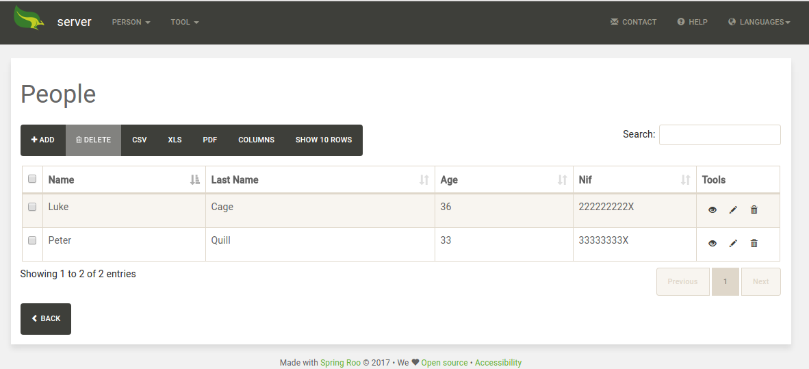
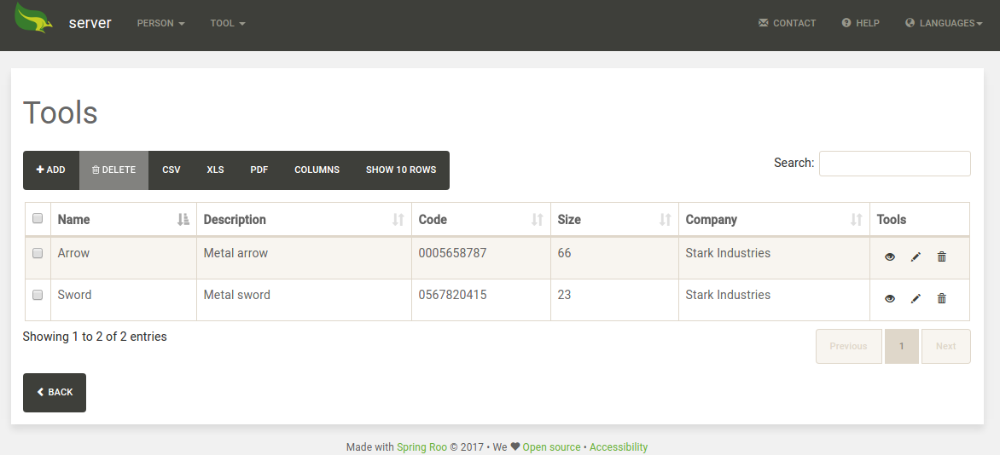
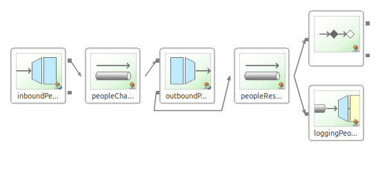
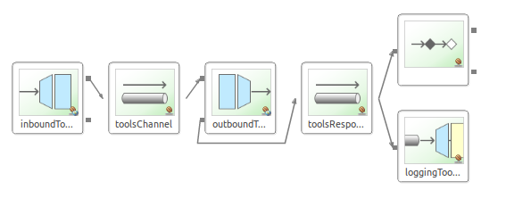
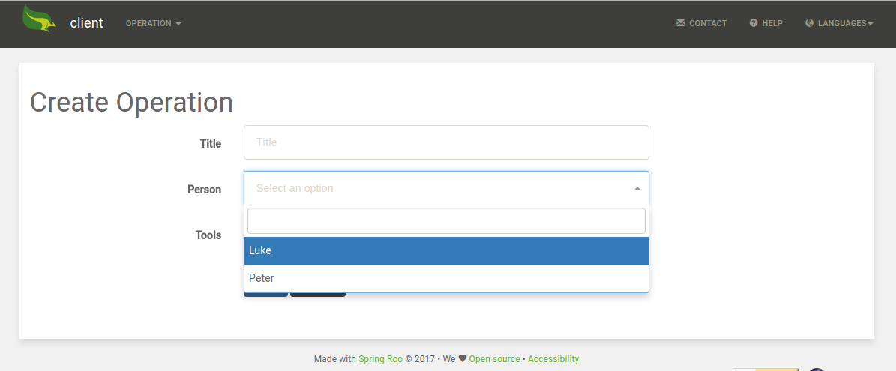
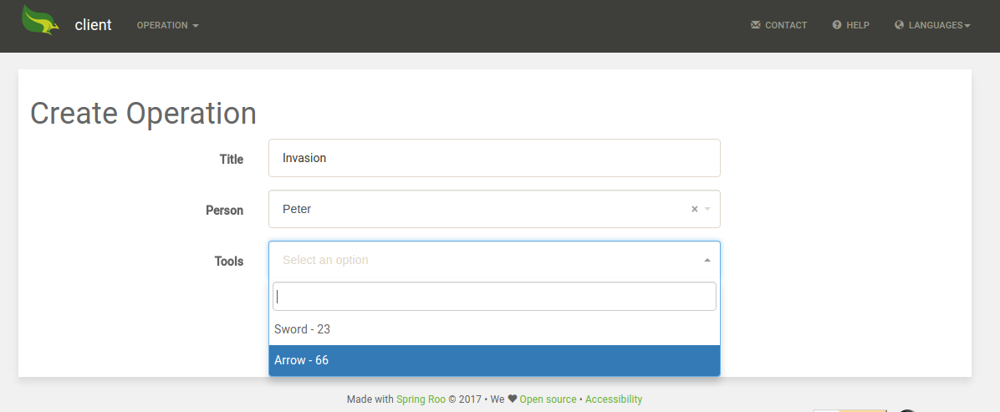
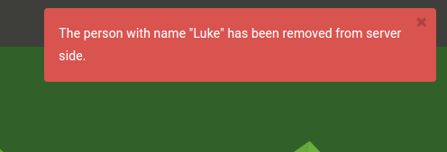

= Spring Integration

This proof of concept tries to show you how to create a basic middleware application using Spring Integration and Spring Boot.

== Description

We supose a background where we need to develop an application to manage operations. To create a new operation, we need to set a new name for the operation, we must choose the person who will do it and we must choose the tool that will be used during that job. 
The people and the tools are not managed in our systems, these items could be provided by some different external companies that offer their workers and their available tools.

== Server side

To be able to test this proof of concept, we are going to create a sample server application using the Spring Roo generation tool. This server-side application is an Spring Boot application that allows you to create new people and new tools. It provides some JSON API REST operations that offers information about the existing elements. 

Also, when some person is removed, notifies to the middleware to be sure that all the integrated applications knows that this person doesn't exist yet. To do that, uses the following code in the `MiddlewareIntegrationServiceImpl.java` from the `delete` method of the `PersonServiceImpl` class:

[source,java]
----
// Use a RestTemplate
RestTemplate template = new RestTemplate();
// Specify the uri where the service is located
String uri = "http://".concat(middlewareUrl).concat(":").concat(middlewarePort).concat("/")
  .concat(middlewareContext).concat("/people/").concat(id.toString());
// Execute the request
template.exchange(uri, HttpMethod.DELETE, null, Void.class);
----

NOTE: _Remember that we have created this server side application because this is only a proof of concept. In a real stage, the server application or server applications will exists and will provide the operations that their owners have been defined before._

=== Testing the server side

. Download the code of this repository
. Navigate to the `spring-integration/server-app` folder.
. Open a new shell and execute the following command:
+
`mvn clean compile spring-boot:run`
. Open your favourite browser and navigate to `http://localhost:8081/server`
. Create some new people
+

. Create some new tools
+

NOTE: _As always, you could import the project to your preferred IDE and execute it as an Spring Boot application or deploying the generated .war file in a Tomcat server_

== Middleware

After create the server side, is time to create the middleware. To implement this middleware we're going to use Spring Boot and Spring Integration. You could create an Spring Boot simple application that includes the Spring Integration boot starter using the Spring Initializr http://start.spring.io/. 

Now that we have a simple Spring Boot project that includes Spring Integration dependencies, is necessary to define the necessary flows to obtain and serve the data by demand.

We're going to use HTTP services in the Spring Integration implementation, so we need to include an extra dependency in our `pom.xml` file:

[source,xml]
----
<dependency>
  <groupId>org.springframework.integration</groupId>
  <artifactId>spring-integration-http</artifactId>
</dependency>
----

NOTE: _We have setted Spring IO Platform as parent, so it's not necessary to specify the version of the new dependencies_

=== People flow

This is the integration graph of the people operations:

And this is the XML definition:

[source,xml]
----
<?xml version="1.0" encoding="UTF-8"?>
<beans xmlns="http://www.springframework.org/schema/beans"
	xmlns:xsi="http://www.w3.org/2001/XMLSchema-instance" xmlns:int="http://www.springframework.org/schema/integration"
	xmlns:int-http="http://www.springframework.org/schema/integration/http"
	xsi:schemaLocation="
    http://www.springframework.org/schema/beans
    http://www.springframework.org/schema/beans/spring-beans.xsd
    http://www.springframework.org/schema/integration
    http://www.springframework.org/schema/integration/spring-integration.xsd
    http://www.springframework.org/schema/integration/http
    http://www.springframework.org/schema/integration/http/spring-integration-http.xsd">

	<!-- COLLECTION -->
	<int:channel id="peopleChannel" />

	<int-http:inbound-gateway id="inboundPeopleGateway"
		path="/people" request-channel="peopleChannel" supported-methods="GET" />

	<int-http:outbound-gateway id="outboundPeopleGateway"
		request-channel="peopleChannel" url="http://localhost:8081/server/api/people"
		http-method="GET" reply-channel="peopleResponseChannel"
		expected-response-type="java.util.List" message-converters="personFromServerConverter" />

	<int:channel id="peopleResponseChannel" />
	<int:service-activator input-channel="peopleResponseChannel"
		ref="peopleResponseServiceActivator" />

	<int:logging-channel-adapter id="loggingPeopleChannel"
		level="INFO" expression="'Sended response with ' + payload" channel="peopleResponseChannel" />

	<!-- ITEM -->
	<int:channel id="personChannel" />

	<int-http:inbound-gateway id="inboundPersonGateway"
		path="/people/{person}" payload-expression="#pathVariables.person"
		request-channel="personChannel" supported-methods="DELETE" />

	<int-http:outbound-gateway
		request-channel="personChannel" http-method="DELETE"
		url="http://localhost:8080/client/api/people/{person}" 
		  expected-response-type="java.lang.Void">
		<int-http:uri-variable name="person" expression="payload" />
	</int-http:outbound-gateway>

</beans>
----

As you could see, it manages the petitions from the client side to the server side and the notifications sended by the server side to the middleware. It defines an `inbound-gateway` that listen the `/people` request. When someone invoke this operation, uses the `outbound-gateway` component to make a petition to the server side. The response of this petition is managed and finally, returns the obtained results. On the other hand, it defines an `inbound-gateway` that listen the `/people/{person}` request with `DELETE` method. When someone invoke this operation, uses the `outbound-gateway` component to make a petition to the client side to notify that some person has been removed. If we need to notify to other systems that some person has been removed, we should include more `outbound-gateway` components.

=== Tools flow

This is the integration graph of the people operations:

The defined components are the same as the people operation.

=== Testing the middleware

. Download the code of this repository
. Navigate to the `spring-integration/middleware` folder.
. Open a new shell and execute the following command:
+
`mvn clean compile spring-boot:run`
. Open your favourite browser and navigate to `http://localhost:8082/middleware`
. If you obtain a Whitelabel error page means that the application has been deployed correctly. Continue to the Client Side section to test the middleware integration.

== Client side

Now that the server application exists and we have the basic middleware with Spring Integration, we're going to create the sample client application using the Spring Roo generation tool. This client-side application is an Spring Boot application that allows you to create new operations and assign to them the people and the tools that will be involved into the process from the server-side. 

To do that, the `PersonServiceImpl.java` invokes to the `MiddlewareIntegrationServiceImpl` that uses the following code to connect with the middleware and obtain the necessary information from the server-side. :

[source, java]
----
@Override
public List<Person> getAllPeople() {
  // Use a RestTemplate
  RestTemplate template = new RestTemplate();
  // Specify the uri where the service is located
  // Change this to use properties
  String uri = "http://".concat(middlewareUrl).concat(":").concat(middlewarePort).concat("/")
		.concat(middlewareContext).concat("/people");
  // Execute the request
  ResponseEntity<Person[]> httpResponse = template.exchange(uri, HttpMethod.GET, null, Person[].class);
  // Return the obtained elements from the http response
  return Arrays.asList(httpResponse.getBody());
}
----

NOTE: _Remember that the middleware is the responsible of transform the server-side person format to the client-side person format, so the client-side receives the available people in its own format._

Also as we've said before, when some Person is removed from the server side, the server sends a notification to the middleware using a `RestTemplate` and the middleware notifies to the the client side using the `outbound-gateway` component. The client side receives the petition into the `delete` method of the `PeopleItemJsonController.java` class and proceed to delete the person too. After that, using WebSocket, SockJS, and STOMP Messaging (new feature of Spring Framework 4.x) we'll able to notify to the view layer that some Person has been removed.

First of all, we're going to configure the WebSocket including the `WebSocketConfig.java` class. 

[source, java]
----
@Configuration
@EnableWebSocketMessageBroker
public class WebSocketConfig extends AbstractWebSocketMessageBrokerConfigurer {

  @Override
  public void configureMessageBroker(MessageBrokerRegistry config) {
    config.enableSimpleBroker("/topic");
    config.setApplicationDestinationPrefixes("/app");
  }

  @Override
  public void registerStompEndpoints(StompEndpointRegistry registry) {
    registry.addEndpoint("/websocket").withSockJS();
  }

}
----

After that, include an `@Autowired SimpMessagingTemplate` into the `PeopleItemJsonController.java` and notifies to the websocket with a custom message about the deleted person.

[source, java]
----
@Autowired
private SimpMessagingTemplate template;

[...]

// Notify to the view side
this.template.convertAndSend("/topic/messages", person.getName());
----

Now, we're sending to the websocket the messages about the deletion, but the view layer doesn't know this messages. We need to include the following javascript libraries that will allow us to susbscribe the view to the websocket and show a notification if some message is published in the websocket. Include the following webjars and include them as scripts into the `layouts`:

[source,xml]
----
<dependency>
  <groupId>org.webjars</groupId>
  <artifactId>sockjs-client</artifactId>
  <version>1.0.2</version>
</dependency>
<dependency>
  <groupId>org.webjars</groupId>
  <artifactId>stomp-websocket</artifactId>
  <version>2.3.3</version>
</dependency>
<dependency>
  <groupId>org.webjars.npm</groupId>
  <artifactId>bootstrap-notify</artifactId>
  <version>3.1.3</version>
</dependency>
----

[source, html]
----

----

After that, creates a `messages.js` file that connect to the websocket when the page is loaded and subscribe to an specific channel to listen if some new message has been published. If some new message appear, show a notification using bootstrap notify.

[source, javascript]
----
/**
 * This file contain the necessary javascript functions to connect to the registered
 * websocket and subscribe the client to the channel that will receive all the
 * STOMP messages.
 */
jQuery(document).ready(function(){
	
	var stompClient = null;
	
	/**
	 * Function that connects with the published websocket and subscribes the
	 * connection to listen the published messages.
	 * 
	 * @returns
	 */
	function connect() {
		var socket = new SockJS('/client/websocket');
		stompClient = Stomp.over(socket);
		stompClient.connect({}, function(frame) {
			stompClient.subscribe('/topic/messages', function(greeting) {
				$.notify({
					// options
					message: 'The person with name "' + greeting.body  + '" has been removed from server side.',
				},{
					// settings
					type: 'danger'
				})
			});
		});
	}
	
	// When the document is ready, connect to the websocket to listen
	// the published messages
	connect();
	
});	

----

NOTE: _In a real stage, this will be the application that we want to develop._

=== Testing the client side

. Download the code of this repository
. Navigate to the `spring-integration/client-app` folder.
. Open a new shell and execute the following command:
+
`mvn clean compile spring-boot:run`
. Open your favourite browser and navigate to `http://localhost:8080/client`
. Repeat the process to launch the 2 other modules (`server-app` and `middleware`)
. From the server side, create some new people and tools as you seen in the previous steps.
. Create some new operation from the client side selecting the person involved and the tool that will be used. As you could see, the obtained list of people and the obtained list of tools are the same items like the created one into the server side.
+

=== Testing the Notification system

. Remove some person from the server side that has been used (or just listed) into the client-side.
. Navigate to the client-app and a notification should appear in the right corner.
+

